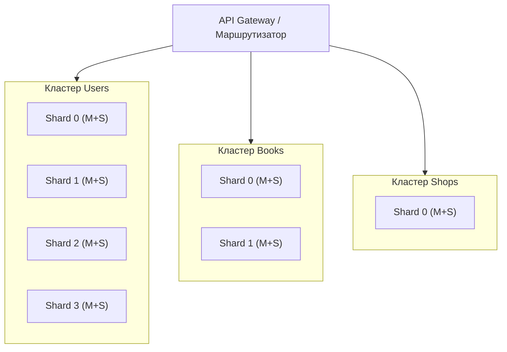

# Replication-and-Scaling.-Part-2
## Домашнее задание к занятию «Репликация и масштабирование. Часть 2» Марина Кукушкина

## Задание 1 

### 1. Активный master + пассивный slave
Главный плюс – простота и надёжность. Единственная точка записи исключает конфликты данных (split‑brain). При сбое мастера есть готовая копия, данные не теряются (при синхронной репликации – вообще нулевые потери). Дополнительно slave можно открыть для чтения, чтобы разгрузить мастер от отчётов и аналитики.

### 2. Master + несколько slave
Это уже горизонтальное масштабирование чтения. Трафик SELECT‑запросов распределяется между репликами, что кратно увеличивает общую пропускную способность системы при высоком соотношении чтения/записи. Также появляется географическая распределённость (слейвы в разных DC) и повышенная отказоустойчивость – выход одного слейва не критичен, а бэкапы можно делать на любой реплике без остановки мастера.

### 3. DRBD (Distributed Replicated Block Device)
Работает на уровне блочного устройства, как сетевой RAID‑1. Ключевое преимущество – синхронное зеркалирование на диск, что гарантирует RPO = 0 – ни одна транзакция не теряется даже при внезапном отключении мастера. Приложение (СУБД) не требует модификации, так как DRBD прозрачно подменяет локальный диск. В связке с менеджером ресурсов (Pacemaker) обеспечивает автоматический failover за секунды, при этом переключается целый сервер (IP, имя), что упрощает сопровождение.

### 4. SAN‑кластер
Вынос хранилища в отдельную высокопроизводительную сеть даёт независимое масштабирование вычислительных мощностей и ёмкости – можно добавлять хосты, не трогая дисковые полки. SAN позволяет подключать множество активных узлов одновременно (Active‑Active), что даёт почти линейный рост производительности и мгновенную отказоустойчивость – отказ одного сервера незаметен для пользователей. Встроенные снапшоты, дедупликация и thin provisioning ускоряют бэкапы и управление данными. Это самый дорогой, но и самый надёжный и производительный вариант для критичных корпоративных систем.

## Задание 2

### Принципы построения

Вертикальный шардинг – таблицы разнесены по трём независимым кластерам БД:

Кластер Users – только users.

Кластер Books – только books.

Кластер Shops – только shops.

Это снижает конкуренцию за ресурсы, упрощает бэкапы и позволяет оптимизировать каждый кластер под свой тип нагрузки.

Горизонтальный шардинг – внутри каждого кластера данные делятся по строкам на основе хэша первичного ключа (user_id, book_id, shop_id).
Каждый шард – отдельная база данных (или партиция). Например, Users – 4 шарда, Books – 2 шарда, Shops – 1.
Запрос по ключу идёт на один шард, что даёт максимальную производительность.

 ## Архитектура системы

### Режимы работы серверов
Мастер – Active (чтение+запись), принимает все INSERT/UPDATE/DELETE.

Слейвы – Read-Only (горячие реплики), обслуживают SELECT, разгружая мастер. Репликация потоковая (асинхронная или синхронная – по требованию). При отказе мастера слейв может быть повышен до мастера (ручной или автоматический failover).

### Внутри каждого шарда
Мастер (Master) – работает в режиме Active (чтение+запись).
Все операции INSERT, UPDATE, DELETE направляются только на мастер.

Слейвы (Slaves) – работают в режиме Read-Only (пассивные реплики).
Принимают все SELECT-запросы, что позволяет распределить нагрузку чтения. Репликация с мастера происходит асинхронно (или синхронно для критичных данных – настраиваемо).
В случае падения мастера один из слейвов может быть повышен до мастера (вручную или через автоматический failover, например, с использованием менеджера кластера).

