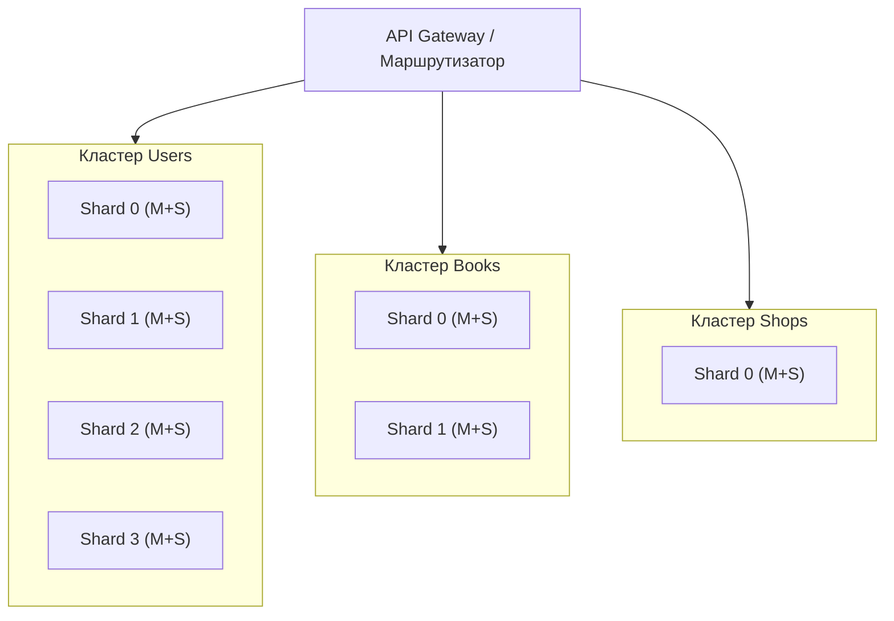

## Домашнее задание к занятию «Репликация и масштабирование. Часть 2» Марина Кукушкина

## Задание 1 

### 1. Активный master + пассивный slave 

Отказоустойчивость – при сбое мастера slave быстро берёт на себя нагрузку (failover), сокращая время простоя.

Резервное копирование без нагрузки – бэкапы можно делать с slave, не нагружая основной сервер.

Тестирование и отчёты – slave можно использовать для проверки изменений или генерации отчётов, не влияя на продуктивный мастер.

### 2. Master + несколько slave-серверов

Горизонтальное масштабирование чтения – запросы SELECT распределяются между несколькими slave, что увеличивает пропускную способность системы.

Повышенная надёжность – выход одного slave не влияет на доступность, нагрузка автоматически перераспределяется на остальные.

Географическая распределённость – slave можно размещать в разных дата-центрах для снижения задержек для удалённых пользователей.

Специализация – разные slave могут обслуживать разные типы задач (аналитика, поиск, отчёты), изолируя нагрузки.

## Задание 2

### Принципы построения

Вертикальный шардинг – таблицы разнесены по трём независимым кластерам БД:

Кластер Users – только users.

Кластер Books – только books.

Кластер Shops – только shops.

Это снижает конкуренцию за ресурсы, упрощает бэкапы и позволяет оптимизировать каждый кластер под свой тип нагрузки.

Горизонтальный шардинг – внутри каждого кластера данные делятся по строкам на основе хэша первичного ключа (user_id, book_id, shop_id).
Каждый шард – отдельная база данных (или партиция). Например, Users – 4 шарда, Books – 2 шарда, Shops – 1.
Запрос по ключу идёт на один шард, что даёт максимальную производительность.

 ## Архитектура системы

### Режимы работы серверов
Мастер – Active (чтение+запись), принимает все INSERT/UPDATE/DELETE.

Слейвы – Read-Only (горячие реплики), обслуживают SELECT, разгружая мастер. Репликация потоковая (асинхронная или синхронная – по требованию). При отказе мастера слейв может быть повышен до мастера (ручной или автоматический failover).

### Внутри каждого шарда
Мастер (Master) – работает в режиме Active (чтение+запись).
Все операции INSERT, UPDATE, DELETE направляются только на мастер.

Слейвы (Slaves) – работают в режиме Read-Only (пассивные реплики).
Принимают все SELECT-запросы, что позволяет распределить нагрузку чтения. Репликация с мастера происходит асинхронно (или синхронно для критичных данных – настраиваемо).
В случае падения мастера один из слейвов может быть повышен до мастера (вручную или через автоматический failover, например, с использованием менеджера кластера).

Я выбрала разное число шардов (Users – 4, Books – 2, Shops – 1) по трём  причинам:

- Разный объём данных
Пользователей обычно в разы больше, чем книг, и тем более магазинов. Если бы мы сделали везде по 4 шарда, то для таблицы shops это было бы избыточно – большинство шардов оставались бы пустыми, а серверы простаивали. Мы выделяем больше шардов под те таблицы, которые растут быстрее.

- Разная нагрузка на чтение/запись

users – много регистраций и обновлений профилей (высокая запись), поэтому нужно больше шардов, чтобы распределить запись.

books – чаще читают (поиск, просмотр), но обновления (изменение цены, остатка) происходят реже. Можно обойтись меньшим числом шардов, но с большим количеством реплик для чтения.

shops – данные меняются крайне редко (открытие нового магазина – событие не ежесекундное). Одного шарда с репликой для надёжности вполне достаточно.

